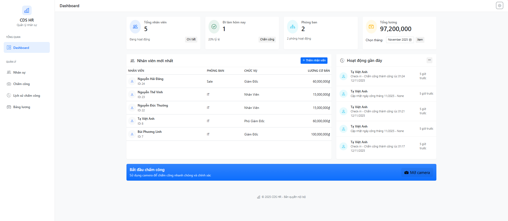
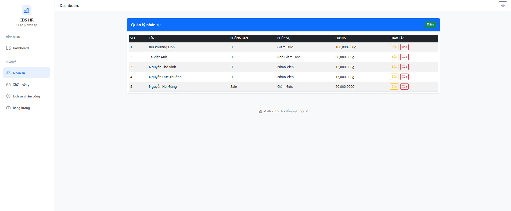
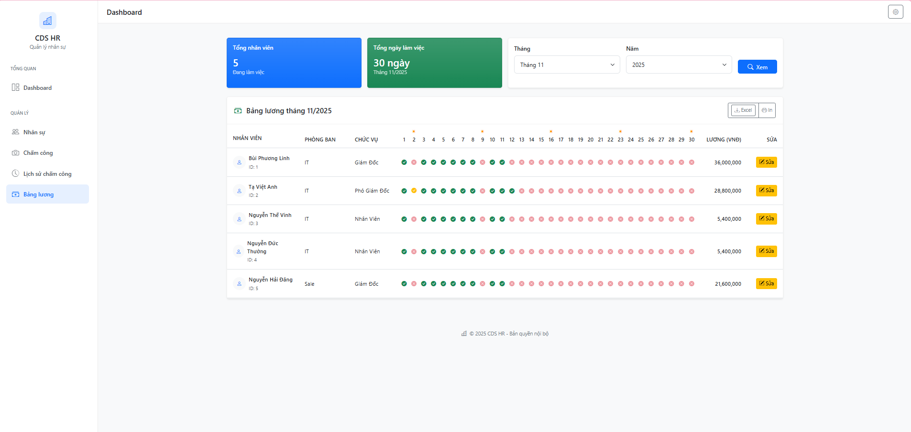
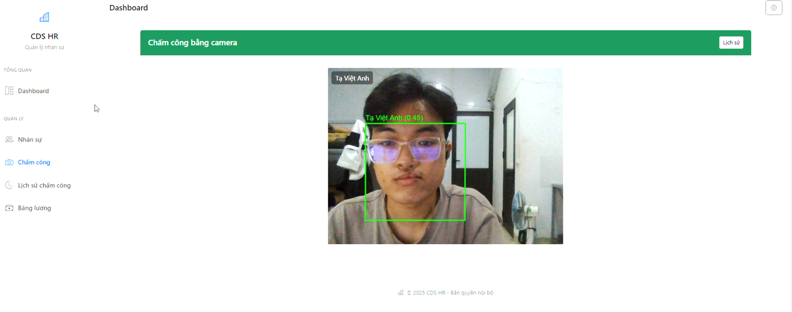
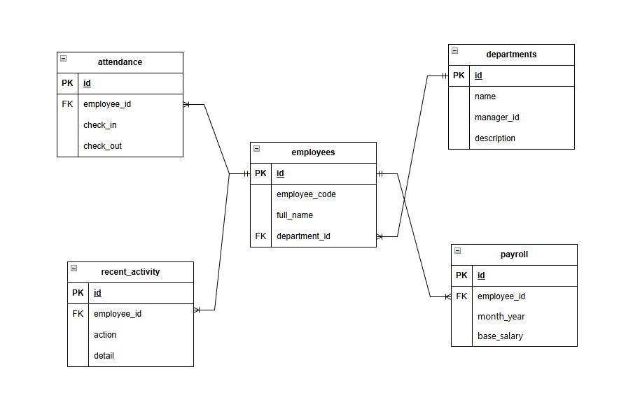

<h2 align="center">
    <a href="https://dainam.edu.vn/vi/khoa-cong-nghe-thong-tin">
    🎓 Faculty of Information Technology (DaiNam University)
    </a>
</h2>
<h2 align="center">
   HỆ THỐNG QUẢN LÝ NHÂN SỰ - TIỀN LƯƠNG
</h2>
<div align="center">
    <p align="center">
        
        
        
    </p>

[](https://www.facebook.com/DNUAIoTLab)
[](https://dainam.edu.vn/vi/khoa-cong-nghe-thong-tin)
[](https://dainam.edu.vn)

</div>

## 📖 Giới thiệu ứng dụng

Hệ thống **Quản lý Nhân sự và Tiền lương Tích hợp Nhận diện Khuôn mặt** là giải pháp toàn diện cho công tác quản trị nhân sự trong kỷ nguyên chuyển đổi số. Hệ thống ứng dụng công nghệ AI để tự động hóa quy trình từ chấm công đến tính lương, mang lại hiệu quả vượt trội so với phương pháp truyền thống.

## ✨ Tính năng chính

- 👥 **Quản lý nhân sự toàn diện** - Quản lý hồ sơ, phòng ban, chức vụ
- 📸 **Chấm công tự động** - Nhận diện khuôn mặt thời gian thực với độ chính xác 95.4%
- 💰 **Tính lương tự động** - Tự động tính lương, phụ cấp, khấu trừ theo quy định
- 🛡️ **Chống gian lận** - Ngăn chặn hiện tượng chấm công hộ
- 📊 **Báo cáo thông minh** - Dashboard tổng quan với KPI và phân tích dữ liệu
- 🔐 **Bảo mật đa lớp** - Mã hóa AES-256, xác thực đa yếu tố, phân quyền RBAC

## 🏆 Kết quả nổi bật

- ✅ **Độ chính xác nhận diện**: 95.4% trong điều kiện thực tế
- ⚡ **Giảm 80%** thời gian xử lý chấm công
- 💰 **Tiết kiệm 65%** chi phí vận hành so với phương pháp truyền thống
- 🎯 **Độ chính xác tính lương**: 99.9%, loại bỏ sai sót

## 🛠️ Công nghệ sử dụng

- **💻 Ngôn ngữ lập trình:** Python 3.9
- **🌐 Web Framework:** Flask 2.3.0
- **🤖 AI & Computer Vision:** OpenCV 4.5.3, dlib, ResNet
- **🗃️ Cơ sở dữ liệu:** Oracle Database 19c
- **🔌 ORM:** SQLAlchemy
- **🎨 Frontend:** HTML5, CSS3, JavaScript, Bootstrap 5
- **📊 Visualization:** Chart.js
- **🔐 Bảo mật:** AES-256, RBAC, OTP
- **⚡ Cache:** Redis 6.2

## 📸 3. Một số hình ảnh hệ thống

### 👤 Giao diện đăng nhập


### 🌐 Giao diện Dashboard


### ➕ Giao diện tab Nhân viên


### ✏️ Giao diện tab Bảng lương 


### 🗃️ Giao diện tab Chấm công


## 📥 4. Các bước cài đặt

### ⚙️ Yêu cầu hệ thống:
- Hệ điều hành: Windows 10/11, macOS, Linux

- Python: 3.9+

- Oracle Database: 11g, 19c hoặc Oracle XE

- Bộ nhớ RAM: Tối thiểu 8GB (khuyến nghị 32GB)


### 🔧 Cài đặt chi tiết:

#### Bước 1: Cài đặt môi trường
- Cập nhật hệ thống
```bash 
sudo apt update && sudo apt upgrade -y
```
- Cài đặt Python và công cụ ảo hóa môi trường
```bash 
sudo apt install python3 python3-pip python3-venv -y
```
- Tạo và kích hoạt môi trường ảo:
```bash 
python3 -m venv venv
source venv/bin/activate
```

#### Bước 2: Cài đặt Oracle Database
1. Tải Oracle Database Express Edition (XE) từ website chính thức

2. Cài đặt theo hướng dẫn

3. Thiết lập mật khẩu cho system user

- Tải JDK từ website Oracle: https://www.oracle.com/java/technologies/javase-downloads.html

#### Bước 3: Clone mã nguồn
 ```bash
git clone https://github.com/vitconxinhxinh/CDS-HeThongQuanLyNhanSuTienLuong.git
```

#### Bước 4: Cấu hình cơ sở dữ liệu
1. Kết nối đến Oracle bằng SQLPlus
2. Chạy script tạo bảng
- Tạo bảng DEPARTMENTS:
```bash
CREATE TABLE DEPARTMENTS (
  id          NUMBER GENERATED BY DEFAULT ON NULL AS IDENTITY PRIMARY KEY,
  name        VARCHAR2(100) NOT NULL,
  note        VARCHAR2(255)
);
```
- Tạo bảng EMPLOYEES:
```bash
CREATE TABLE EMPLOYEES (
  id             NUMBER GENERATED BY DEFAULT ON NULL AS IDENTITY PRIMARY KEY,
  employee_code  VARCHAR2(50)  NOT NULL UNIQUE,
  full_name      VARCHAR2(200) NOT NULL,
  email          VARCHAR2(150),
  phone          VARCHAR2(50),
  department_id  NUMBER,
  position       VARCHAR2(100),
  base_salary    NUMBER(15,2) DEFAULT 0,
  salary_type    VARCHAR2(20) DEFAULT 'monthly',
  hire_date      DATE,
  active         CHAR(1) DEFAULT '1',
  created_at     TIMESTAMP,
  updated_at     TIMESTAMP,
  CONSTRAINT fk_employees_departments FOREIGN KEY (department_id)
    REFERENCES DEPARTMENTS (id)
);
```
- Tạo bảng ATTENDANCE
```bash
CREATE TABLE ATTENDANCE (
  id               NUMBER GENERATED BY DEFAULT ON NULL AS IDENTITY PRIMARY KEY,
  employee_id      NUMBER,
  "timestamp"      TIMESTAMP DEFAULT SYSTIMESTAMP,
  status           VARCHAR2(10),
  image            VARCHAR2(255),
  late_minutes     NUMBER(10) DEFAULT 0,
  late_penalty     NUMBER(15,2) DEFAULT 0,
  overtime_minutes NUMBER(10) DEFAULT 0,
  overtime_pay     NUMBER(15,2) DEFAULT 0,
  CONSTRAINT fk_attendance_employees FOREIGN KEY (employee_id)
    REFERENCES EMPLOYEES (id)
);
```
- Tạo bảng PAYROLLS:
```bash
CREATE TABLE PAYROLLS (
  id           NUMBER GENERATED BY DEFAULT ON NULL AS IDENTITY PRIMARY KEY,
  employee_id  NUMBER,
  month_year   VARCHAR2(7) NOT NULL, 
  base_salary  NUMBER(15,2),
  allowances   NUMBER(15,2),
  overtime     NUMBER(15,2),
  deductions   NUMBER(15,2),
  tax          NUMBER(15,2),
  net_salary   NUMBER(15,2),
  generated_at TIMESTAMP,
  CONSTRAINT fk_payrolls_employees FOREIGN KEY (employee_id)
    REFERENCES EMPLOYEES (id)
);
```
- Tạo bảng RECENT_ACTIVITY:
```bash
CREATE TABLE RECENT_ACTIVITY (
  id          NUMBER GENERATED BY DEFAULT ON NULL AS IDENTITY PRIMARY KEY,
  employee_id NUMBER,
  action      VARCHAR2(100),
  detail      VARCHAR2(255),
  "timestamp" TIMESTAMP DEFAULT SYSTIMESTAMP,
  CONSTRAINT fk_recent_activity_employees FOREIGN KEY (employee_id)
    REFERENCES EMPLOYEES (id)
);
```
- Biểu đổ ERD  


#### Bước 5: Cấu hình kết nối database
- Chỉnh sửa file cấu hình config.py: 
 ```bash
DB_CONFIG = {
    'user': 'hrms',
    'password': 'hrms123',
    'dsn': 'localhost:1521/xe'
}
``` 
- Kết nối thông qua SQLAlchemy:
```bash
from sqlalchemy import create_engine

engine = create_engine(f'oracle+cx_oracle://{DB_CONFIG["user"]}:{DB_CONFIG["password"]}@{DB_CONFIG["dsn"]}') 
```

#### Bước 6: Chạy ứng dụng
1. Chạy server Flask: 
```bash
python app.py
```
2. Ứng dụng chạy tại:
```bash
http://localhost:5000
```

## 📞 5. Liên hệ

Nếu có bất kỳ thắc mắc hay góp ý nào, vui lòng liên hệ:
- **👤 Cá nhân:** Tạ Việt Anh
- **📍 Địa chỉ:** Hà Đông, Hà Nội  
- **📧 Email:** tavietanh101004@gmail.com 
---


© 2023 - Khoa Công nghệ Thông tin - Đại học Đại Nam 
